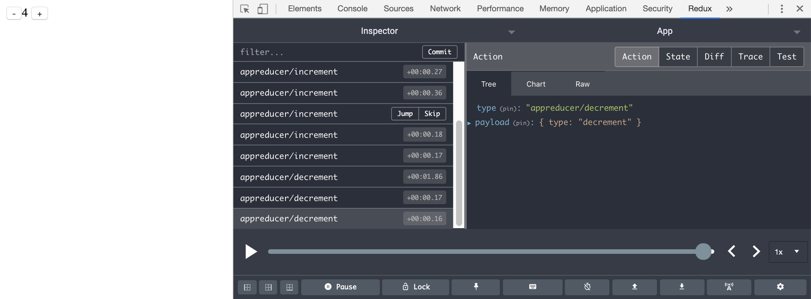

## Redux devtools integration

### First clone this repo install dependencies and build the project

```
git clone git@github.com:ryardley/ts-bus.git
yarn
yarn build
```

### Install the deps of the example and run the example

```
cd ./ts-bus/examples/with-redux-dev-tools
yarn
yarn start
```

Open up redux dev tools and you should see bus events displaying.


